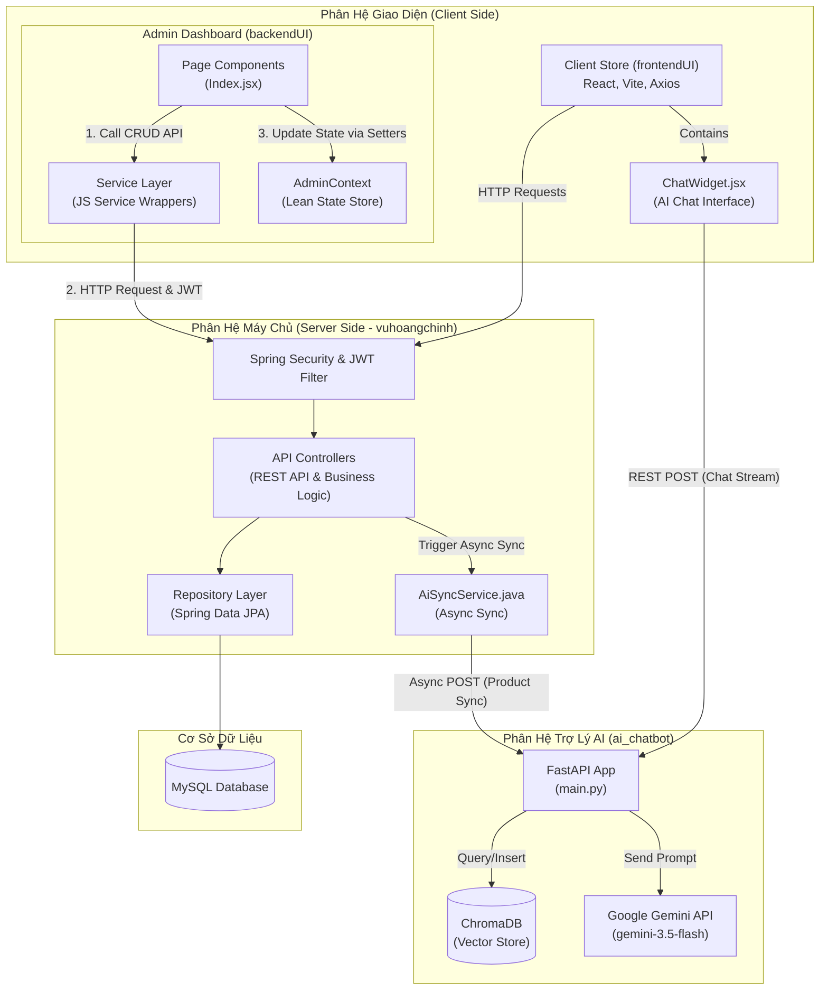
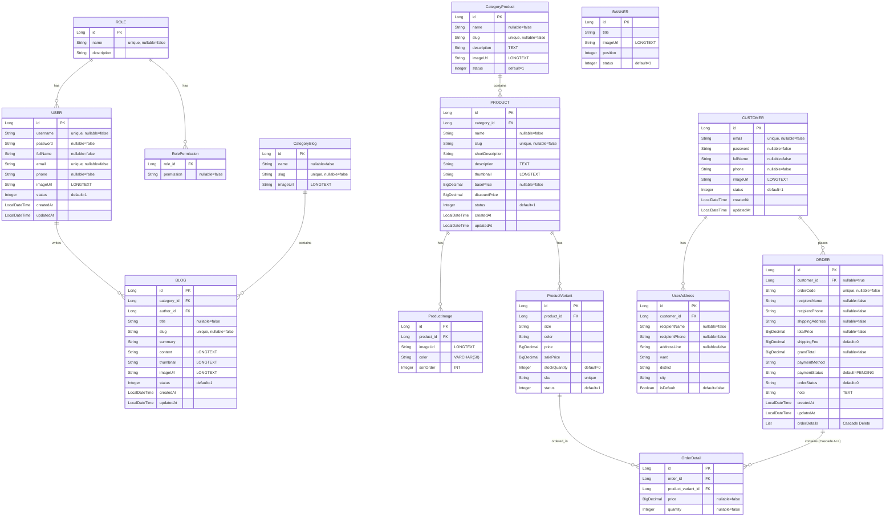

# Hệ Thống Quản Trị & API Bán Hàng (Sales Admin Dashboard & Spring Boot REST API)

## 📝 Mô Tả Cơ Bản

Dự án **Hệ Thống Quản Trị & API Bán Hàng** là một giải pháp quản lý bán hàng và thương mại điện tử khép kín, an toàn và chuyên nghiệp. Dự án được phân tách rõ ràng thành ba phân hệ độc lập:
1. **Backend (`vuhoangchinh`)**: Xây dựng bằng Java Spring Boot, cung cấp các RESTful API kết nối với cơ sở dữ liệu MySQL, được bảo vệ nghiêm ngặt bằng Spring Security kết hợp với JWT Token, kiểm tra tính toàn vẹn của dữ liệu và tự động sinh SEO url (slug).
2. **Admin Frontend (`backendUI`)**: Giao diện quản trị Single Page Application (SPA) dành cho quản trị viên/nhân viên, xây dựng trên React, Vite và Tailwind CSS, mang thiết kế giao diện tối (Dark Mode) hiện đại với hiệu ứng Glassmorphism bắt mắt, giúp quản lý toàn bộ hệ thống đơn hàng, sản phẩm, danh mục, tin tức và nhân viên.
3. **Store Frontend (`frontendUI`)**: Giao diện trang bán hàng (Client Store) dành cho khách hàng truy cập mua sắm, xây dựng trên React, Vite và Axios, phục vụ xem sản phẩm, phân loại, tìm kiếm và đặt hàng.

---

## 🏗️ Kiến Trúc Hệ Thống

Dự án áp dụng mô hình kiến trúc phân tầng tách biệt rõ ràng ở cả Frontend và Backend:
* **Frontend Quản Trị (backendUI)**: Loại bỏ kiến trúc Context-monolith (không gán logic API cồng kềnh trong Context). Thay vào đó, các **Page Components** tương tác trực tiếp với các **API Services** riêng biệt, nhận dữ liệu phản hồi rồi sử dụng **AdminContext** (Lean State Store) làm kho chứa trạng thái và bộ cập nhật (setters) để đồng bộ lại dữ liệu toàn cục.
* **Backend (vuhoangchinh)**: Kiến trúc tinh gọn dạng **REST Controller - JPA Repository** trực tiếp (không sử dụng tầng Service trung gian dư thừa). Các Controller đảm nhận cả nghiệp vụ và giao tiếp qua Filter bảo mật của **Spring Security & JWT Filter Chain** trước khi ghi dữ liệu xuống MySQL.



---

## 🗃️ Sơ Đồ Quan Hệ Thực Thể (Database ERD Diagram)

Dưới đây là sơ đồ quan hệ của toàn bộ 13 thực thể (Entities) của hệ thống được ánh xạ từ Java Spring Boot (`com.example.vuhoangchinh.Entities`) xuống cơ sở dữ liệu MySQL, cùng với bảng quyền hạn lưu động:



---

## 🛠️ Chi Tiết Toàn Bộ Kỹ Thuật Được Sử Dụng Trong Dự Án

### 1. Kiến Trúc Phát Triển Phần Mềm (Architectural Patterns)
* **Client-Server Decoupling (Tách biệt Client-Server)**: 
  * Dự án tách biệt hoàn toàn giữa giao diện người dùng và máy chủ xử lý dữ liệu.
  * Toàn bộ quá trình trao đổi thông tin được thực thi bằng cách gọi các REST API, truyền nhận dữ liệu qua định dạng JSON. Cấu trúc này cho phép dễ dàng nâng cấp, thay thế hoặc tích hợp thêm ứng dụng di động (Mobile App) trong tương lai mà không cần cấu hình lại tầng xử lý nghiệp vụ chính.
* **Layered Architecture (Kiến trúc phân tầng 3 lớp)**:
  * Phân hệ backend được chia thành 3 lớp riêng biệt để đảm bảo tính dễ bảo trì (maintainability) và dễ viết kiểm thử (testability):
    1. **Controller Layer**: Tiếp nhận yêu cầu HTTP từ các client, thực hiện bẫy lỗi dữ liệu đầu vào (Validation) thông qua Jakarta Beans và gửi dữ liệu xuống tầng Service/Repository, trả về mã trạng thái HTTP thích hợp (`200 OK`, `201 Created`, `400 Bad Request`, `401 Unauthorized`, `404 Not Found`).
    2. **Entity Layer**: Chứa các lớp POJO mô hình hóa cơ sở dữ liệu quan hệ sang lập trình hướng đối tượng (Object-Relational Mapping - ORM) thông qua JPA/Hibernate.
    3. **Repository Layer**: Sử dụng Spring Data JPA kế thừa từ `JpaRepository` để tạo ra các câu lệnh SQL truy vấn tĩnh và động (như tự viết câu query tùy biến `findByName`, `findByUsername`).

---

### 2. Kỹ Thuật Bảo Mật & Xác Thực (Security & Cryptography)
* **Stateless JWT Token Authentication (Xác thực phi trạng thái)**:
  * Không sử dụng Session lưu trên bộ nhớ Server để giảm tải RAM và tránh nguy cơ bị tấn công CSRF (Cross-Site Request Forgery).
  * Khi đăng nhập thành công, Server phát hành một chữ ký điện tử mã hóa dạng JWT Token chứa thông tin định danh và thời hạn hết hiệu lực. 
  * Client lưu Token này vào `localStorage` và tự động đính kèm vào tiêu đề HTTP Request dưới dạng `Authorization: Bearer <token>` mỗi khi gọi các API cần quyền hạn bảo mật.
* **Spring Security Filter Chain**:
  * Tích hợp bộ lọc bảo mật tùy biến `JwtAuthenticationFilter` kế thừa `OncePerRequestFilter`. Bộ lọc này chặn các yêu cầu HTTP gửi đến, giải mã JWT Token, trích xuất thông tin người dùng và quyền hạn (Authorities), sau đó nạp đối tượng đăng nhập vào ngữ cảnh bảo mật (`SecurityContextHolder`) để kích hoạt phiên làm việc bảo mật tạm thời.
* **Mã Hóa Mật Khẩu Bằng BCrypt**:
  * Mật khẩu người dùng hệ thống (Nhân viên, Quản trị viên) và Khách hàng đăng ký mua sắm đều được mã hóa bằng giải thuật băm một chiều BCrypt kết hợp cơ chế muối ngẫu nhiên (Salt) trước khi lưu trữ vật lý vào bảng `users` và `customers`. Ngăn chặn hoàn toàn việc rò rỉ thông tin mật khẩu ngay cả khi cơ sở dữ liệu bị tấn công chiếm quyền đọc.
* **Chặn Đứng Lỗ Hổng Bảo Mật Từ Swagger UI & API Trực Tiếp**:
  * Sử dụng cấu hình kiểm duyệt nghiêm ngặt trong `SecurityConfig.java`. Ngoại trừ các API đọc thông tin sản phẩm/bài viết công khai phục vụ SEO (`GET /api/products/**`, `GET /api/blogs/**`) và đặt hàng (`POST /api/orders`), tất cả các hành động chỉnh sửa, cập nhật, xóa dữ liệu (`POST`, `PUT`, `DELETE`) trên mọi phân hệ và tất cả các API quản trị (`/api/users/**`, `/api/roles/**`) đều yêu cầu chữ ký JWT hợp lệ. Nhập token giả mạo (như `"123"`) sẽ bị bộ lọc Spring Security trả về lỗi `401 Unauthorized` / `403 Forbidden` ngay lập tức.
* **Dynamic Role-Based Access Control (RBAC) - Phân Quyền Động Theo Database**:
  * Các quyền hạn chi tiết (ví dụ `manage_product`, `manage_order`) không bị hardcode trong mã nguồn Java mà được lưu trữ và tùy biến động tại bảng cơ sở dữ liệu `role_permissions` (được liên kết bằng `@ElementCollection(fetch = FetchType.EAGER)` trong thực thể `Role`). 
  * Quản trị viên có thể trực tiếp bật/tắt các quyền này trên giao diện quản lý vai trò. Khi lưu, client gửi yêu cầu `PUT /api/roles/{id}` để cập nhật trực tiếp vào cơ sở dữ liệu, ngay lập tức áp dụng cho toàn bộ nhân viên thuộc vai trò đó.
* **Tự Động Làm Sạch Phiên Đăng Nhập Lỗi (Automatic Session Token Eviction)**:
  * Nhằm giải quyết triệt để lỗi vòng lặp gọi API vô tận khi token xác thực JWT lưu ở Client hết hạn hoặc không hợp lệ (gây ra hàng loạt lỗi `403 Forbidden` liên tiếp trên Console trình duyệt), hệ thống triển khai cơ chế làm sạch phiên động tại `Header.jsx`.
  * Khi hàm kiểm tra thông tin khách hàng `getCustomerById` bắt được ngoại lệ lỗi 403 từ Axios Client, hệ thống tự động kích hoạt hàm xóa cookie (`eraseCookie('customer')` và `eraseCookie('token')`), dọn dẹp sạch vùng lưu trữ cookie/localStorage và reset giao diện Header về trạng thái khách vãng lai (Guest Mode). Chặn đứng việc trình duyệt lặp lại các yêu cầu mạng không hợp lệ và tối ưu tài nguyên mạng của Client.

---

### 3. Kỹ Thuật Ràng Buộc & Tính Toàn Vẹn Dữ Liệu (Data Integrity & Validation)
* **Jakarta Validation Constraints (Ràng buộc ở mức thực thể)**:
  * Sử dụng các annotations chuẩn mực để loại bỏ dữ liệu rác, đảm bảo tính hợp lệ từ phía máy chủ:
    * `@NotBlank`, `@NotNull`: Chặn các giá trị trống hoặc rỗng.
    * `@Email`: Kiểm tra định dạng email chuẩn xác (ví dụ `user@domain.com`).
    * `@Size(min = 6, max = 100)`: Khống chế độ dài ký tự tối thiểu và tối đa của mật khẩu, số điện thoại hoặc mã sản phẩm.
    * `@Min(0)`: Ngăn chặn việc nhập giá sản phẩm hoặc tồn kho mang giá trị âm.
* **Ràng Buộc Khóa Ngoại & Tính Toàn Vẹn Tham Chiếu (ForeignKey Integrity)**:
  * Tích hợp cơ chế kiểm tra mối quan hệ liên kết dữ liệu trước khi xóa. Ví dụ:
    * Sản phẩm có chứa khóa ngoại trong bảng đơn hàng (`order_details`) sẽ bị chặn không cho phép xóa khỏi hệ thống để tránh lỗi mất lịch sử mua hàng.
    * Xóa Danh mục sẽ bị chặn nếu đang có Sản phẩm hoặc Bài viết tham chiếu trực thuộc.
    * **Kiểm tra ràng buộc Khách hàng (Customer Delete Constraint)**: Khách hàng có đơn hàng liên kết sẽ bị chặn xóa ở cả tầng Frontend và Backend. Giao diện quản trị sẽ tự động mở Modal cảnh báo liệt kê các đơn hàng liên quan kèm nút **Xóa đơn hàng** riêng biệt. Sau khi dọn dẹp hết đơn hàng liên kết, tài khoản khách hàng mới có thể được xóa. Khi xóa thành công, hệ thống tự động xóa sạch toàn bộ Sổ địa chỉ (`UserAddress`) liên kết trong CSDL để tránh lưu trữ rác.
    * **Kiểm tra ràng buộc Nhân sự (User Delete Constraint)**: Nhân viên hệ thống đã biên tập bài viết Blog sẽ bị chặn xóa để bảo toàn dữ liệu tác giả. Giao diện quản trị sẽ tự động mở Modal cảnh báo các bài viết Blog liên kết kèm nút **Xóa bài viết** tương ứng. Tài khoản nhân viên chỉ có thể được xóa khi không còn bài viết nào do họ biên tập trên hệ thống.
* **Global Exception Handling (Bộ xử lý ngoại lệ toàn cục)**:
  * Định nghĩa lớp `@RestControllerAdvice` để "bẫy" toàn bộ các ngoại lệ ném ra trong quá trình chạy chương trình. 
  * Thay vì để lộ mã lỗi dài dòng hoặc sập dịch vụ (gây lỗi `500 Internal Server Error`), hệ thống sẽ phân tích lỗi (ví dụ lỗi nhập liệu từ `@Valid`, lỗi khóa chính trùng lặp `SQLIntegrityConstraintViolationException`) và định dạng lại thành chuỗi JSON phản hồi có mã HTTP 400 hoặc 409 chi tiết, chỉ rõ trường nào bị lỗi và lỗi gì để lập trình viên frontend hiển thị lên giao diện người dùng.

---

### 4. Nghiệp Vụ Nâng Cao & Tự Động Hóa (Advanced Business Logic & Automation)
* **Tự Động Tạo Đường Dẫn SEO (Accented Vietnamese to SEO Slug Converter)**:
  * Tích hợp module chuyển đổi chữ tiếng Việt có dấu thành dạng không dấu, viết thường, ngăn cách bằng dấu gạch ngang (ví dụ: *"Bánh Kem Vị Dâu Tây"* -> *"banh-kem-vi-dau-tay"*).
  * Quy trình này hoạt động tự động trong tầng nghiệp vụ của Danh mục sản phẩm, Sản phẩm và Bài viết tin tức khi người dùng bỏ trống trường `slug`.
* **Cơ Chế Tạo Mã Đơn Hàng Tự Động (Auto OrderCode Generator)**:
  * Mã đơn hàng được tự động sinh ngẫu nhiên khi khách hàng tạo đơn nếu để trống. Định dạng mã theo cấu trúc `ORD-ddMMyyyy-XXXXX` (với `XXXXX` là chuỗi 5 ký tự ngẫu nhiên hoặc số tuần tự mã hóa), vừa hiển thị chuyên nghiệp vừa đảm bảo tính duy nhất, tránh trùng lặp mã đơn trong hệ thống.
* **Quản Lý Tồn Kho Đồng Thời & Chống Race Condition (Atomic Inventory Sync)**:
  * **Giải quyết bài toán "Tranh mua sản phẩm"**: Khi khách hàng tiến hành thanh toán, hệ thống áp dụng kỹ thuật truy vấn nguyên tử (Atomic Update) cấp độ cơ sở dữ liệu thông qua `@Modifying @Query` (trừ tồn kho trực tiếp bằng raw SQL trên MySQL). Kỹ thuật này ngăn chặn hoàn toàn hiện tượng Race Condition khi nhiều khách hàng cùng mua một mặt hàng cuối cùng.
  * Nếu kho hàng vừa bị thay đổi bởi người khác, hệ thống lập tức kích hoạt `Rollback Transaction` để hủy bỏ toàn bộ tiến trình tạo hóa đơn bị lỗi, đồng thời đẩy phản hồi HTTP 400 Bad Request. Giao diện Frontend sẽ khéo léo hiển thị cảnh báo từ chối thanh toán và yêu cầu khách cập nhật lại giỏ hàng thay vì báo lỗi crash hệ thống.
* **Tối Ưu Trải Nghiệm Mua Sắm (Cart & Buy Now UX)**:
  * Hệ thống kiểm soát số lượng cực kỳ chặt chẽ bằng cách cộng dồn chéo tất cả các biến thể (kích cỡ, màu sắc) của cùng một sản phẩm đang có trong giỏ, đảm bảo không một ai có thể vượt rào giới hạn tồn kho.
  * Nút "Mua ngay" (Buy Now) được tối ưu thông minh: tự động gạt bỏ các cảnh báo lỗi gây phiền nhiễu nếu khách hàng đã đạt hạn mức tồn kho, thay vào đó hệ thống tự động chốt số lượng tối đa và đưa khách qua trang thanh toán một cách mượt mà nhất.
* **Database Auto-Seeder (Tự Động Khởi Tạo Dữ Liệu Chạy Thử)**:
  * Sử dụng lớp `DataSeeder` triển khai giao diện `CommandLineRunner` của Spring Boot. Khi ứng dụng khởi chạy lần đầu tiên trên cơ sở dữ liệu trắng, lớp này tự động kiểm tra và thêm mới toàn bộ:
    * Các vai trò chuẩn hệ thống: `ROLE_ADMIN`, `ROLE_EDITOR`, `ROLE_EMPLOYEE` kèm phân quyền tương ứng.
    * Tài khoản Admin tối cao: `admin_duong` (mật khẩu mặc định `chinh123`).
    * Dữ liệu chạy thử bao gồm: Danh mục sản phẩm, Biến thể sản phẩm, Tin tức mẫu, Banner mẫu, giúp kiểm thử ứng dụng ngay lập tức mà không cần tạo tay.
* **Hệ Thống Lưu Trữ Hình Ảnh Base64 Tự Chứa (Self-Contained Base64 Image Storage)**:
  * Để đơn giản hóa kiến trúc lưu trữ mà không cần cấu hình thêm các dịch vụ lưu trữ ngoài (như AWS S3) hay lưu trữ thư mục tĩnh cục bộ phức tạp, dự án mã hóa mọi tệp tin hình ảnh tải lên từ phía Client thành các chuỗi **Base64 Data URLs**.
  * Nhằm tránh lỗi tràn dung lượng bộ nhớ cột của MySQL (`Data truncation: Data too long for column`), toàn bộ các trường hình ảnh ở phía Backend (`User.java`, `Customer.java`, `Product.java`, `Blog.java`, `CategoryProduct.java`, `CategoryBlog.java`, `Banner.java`, `ProductImage.java`) đều được cấu hình bằng kiểu dữ liệu `@Column(columnDefinition = "LONGTEXT")`, hỗ trợ lưu trữ chuỗi dữ liệu lớn lên đến 4GB mỗi bản ghi.
  * **Cơ chế tự động dọn dẹp ảnh rác**: Do chuỗi ảnh được lưu trữ trực tiếp trong các hàng (rows) của bảng cơ sở dữ liệu (chứ không lưu dạng file tĩnh độc lập trên máy chủ), nên khi xóa bản ghi (như Xóa sản phẩm, Khách hàng, Bài viết) hoặc cập nhật ảnh mới, dữ liệu ảnh cũ sẽ **tự động bị xóa sạch/ghi đè hoàn toàn** cùng với bản ghi đó mà không bao giờ để lại các file ảnh mồ côi (orphaned files) gây lãng phí bộ nhớ lưu trữ vật lý của server.
* **Hệ Thống Gửi Email Hóa Đơn SMTP Đính Kèm Chi Tiết Biến Thể & Đính Kèm Ảnh Inline CID**:
  * Khi khách hàng hoàn tất quy trình checkout trực tuyến, Backend tự động kích hoạt tiến trình gửi email qua `EmailService.java` cấu hình SMTP Gmail.
  * Thư xác nhận đơn hàng hiển thị dưới dạng bảng HTML chuyên nghiệp chứa đầy đủ danh sách giày đã mua, phân loại Kích cỡ (Size), Màu sắc (Color) rõ ràng của từng biến thể sản phẩm.
  * Để bảo đảm hình ảnh sản phẩm luôn hiển thị ổn định trên mọi ứng dụng mail (Gmail, Outlook) mà không bị lỗi hoặc bị chặn bảo mật, hệ thống sử dụng cơ chế Content-ID (CID) đính kèm ảnh inline (`helper.addInline`). Hệ thống tự động phân loại: nếu là ảnh Base64 hoặc đường dẫn file cục bộ (`/image/...`), nó sẽ giải mã/đọc file thành byte array rồi đính kèm trực tiếp vào MIME email, tham chiếu qua thẻ ``. Đối với các ảnh từ link CDN bên ngoài, hệ thống tự động giữ nguyên đường dẫn tuyệt đối.

---

### 5. Kỹ Thuật Frontend Hiện Đại (Frontend Engineering Techniques)
* **HTML5 History API Routing (Định tuyến SPA không tải lại trang)**:
  * Thay vì sử dụng bộ định tuyến cồng kềnh, Admin Dashboard sử dụng một giải pháp tùy biến tích hợp `window.history.pushState` kết hợp lắng nghe sự kiện `popstate`. 
  * Kỹ thuật này giúp thay đổi đường dẫn URL trên thanh trình duyệt một cách mượt mà và tự nhiên nhất (từ `/` sang `/products`, `/roles`, `/orders`) đồng thời cho phép người dùng F5 tải lại trang ở bất cứ liên kết nào mà không gặp hiện tượng bị đưa về trang chủ.
* **React Context API State Management**:
  * Sử dụng `AdminContext.jsx` để tập trung hóa việc quản lý dữ liệu. Các danh sách (Sản phẩm, Đơn hàng, Vai trò, Khách hàng) được lưu trữ tại Context và cung cấp xuống các thành phần UI thông qua React Hook `useAdmin()`. Khi có sự thay đổi dữ liệu (như Thêm/Sửa/Xóa), Context sẽ kích hoạt render lại các thành phần liên quan một cách phản ứng (Reactive).
* **FileReader API & Image Live Previews**:
  * Tích hợp đối tượng `FileReader` chuẩn của HTML5 để đọc trực tiếp các tệp tin hình ảnh cục bộ mà quản trị viên tải lên, hiển thị trực quan lên giao diện xem trước (Live Preview) thời gian thực trước khi lưu trữ (áp dụng ở Sản phẩm, Khách hàng, Tin tức và Danh mục sản phẩm/tin tức).
* **Safe Date Parsing & Rendering Helpers**:
  * Giải quyết xung đột tuần tự hóa ngày tháng của Jackson (khi `LocalDateTime` của Java được trả về dưới dạng mảng JSON `[năm, tháng, ngày, giờ, phút, giây]`). Dự án sử dụng hàm phân rã mảng ngày tháng an toàn trên Frontend để tránh ném ra ngoại lệ `RangeError: Invalid time value` làm sập giao diện React.
* **Hiệu Ứng Glassmorphism Cao Cấp & Cấu Trúc CSS**:
  * Thiết kế giao diện tối (Dark Mode) huyền bí. Áp dụng hiệu ứng mờ hậu cảnh (`backdrop-filter: blur()`), kết hợp đường viền mờ (`border: 1px solid rgba(255,255,255,0.05)`) và dải màu chuyển sắc (Gradients) từ tím sang hồng neon.
  * Sử dụng các micro-animations cho các nút bấm (nhấp nháy chậm, phóng to nhẹ khi di chuột) để mang lại cảm giác sống động, hiện đại và cao cấp.
* **Vẽ Biểu Đồ Động Bằng Recharts**:
  * Sử dụng thư viện Recharts để kết xuất các biểu đồ vector (SVG) chất lượng cao phản ứng theo kích thước màn hình (Responsive Charts). Giúp hiển thị trực quan biểu đồ xu hướng doanh thu và cơ cấu danh mục bán chạy nhất trên Dashboard.
* **Tương Tác Kéo Thả Trực Quan (Live Swap Layout Animation)**:
  * Trang Quản lý Banner được tích hợp thư viện lõi `@dnd-kit` hiện đại. Cho phép quản trị viên kéo thả các thẻ hình ảnh (Grid Layout) để sắp xếp thứ tự hiển thị. Đặc biệt, khi di chuyển một banner tới vị trí của banner khác, các thẻ sẽ lập tức "trượt mượt mà" để hoán đổi chỗ cho nhau (Live Layout Animation), tạo cảm giác tương tác cực kỳ cao cấp ngang ngửa các hệ thống quản trị hàng đầu. Dữ liệu sau đó sẽ được hệ thống đồng bộ ngầm toàn bộ vị trí (position) mới xuống Backend thông qua API Bulk Update.
* **Cơ Chế Tự Động Tái Cấp Phát Vị Trí (Auto-sequencing State)**:
  * Khi người quản trị thêm một banner mới hoặc xóa một banner bất kỳ ở giữa danh sách, Frontend sẽ ngay lập tức tính toán và dồn lại số thứ tự (`position`) của tất cả các banner còn lại để lấp đầy khoảng trống (đảm bảo tính liên tục 1, 2, 3...). Sau đó hệ thống sẽ âm thầm gọi API Bulk Update xuống Backend để bảo toàn tính nhất quán tuyệt đối giữa Cơ sở dữ liệu và Giao diện UI.
* **Hệ Thống Thư Viện Ảnh (Multi-Image Gallery) & Hiệu Ứng Nâng Cao**:
  * Cho phép người quản trị upload 1 ảnh đại diện và tối đa 4 ảnh phụ trợ (gallery) cho mỗi sản phẩm.
  * Tích hợp cơ chế lấy ảnh qua API bất đồng bộ và tự động hiển thị dải Thumbnail trên giao diện khách hàng.
  * Ứng dụng CSS nâng cao: tự động Scale, Hover, Fade-in mượt mà khi khách hàng chuyển đổi ảnh, cùng thanh cuộn Custom Scrollbar chuyên nghiệp mô phỏng các nền tảng thương mại điện tử lớn.
* **Bắt Buộc Lựa Chọn Biến Thể Tại Trang Chi Tiết (Forced Product Variant Selection Flow)**:
  * Để cải thiện trải nghiệm khách hàng (UX) và tránh lỗi mua nhầm kích thước hoặc thuộc tính mặc định, hệ thống gỡ bỏ các nút hành động nhanh "Thêm vào giỏ" và "Mua ngay" tại màn hình danh sách sản phẩm (`ProductCard.jsx`).
  * Các nút bấm này được thay thế bằng nút **"Xem chi tiết"** duy nhất. Nút bấm này điều hướng khách hàng trực tiếp đến trang chi tiết sản phẩm (`ProductDetail.jsx`), buộc khách hàng phải chủ động lựa chọn các thuộc tính Kích cỡ (Size), Màu sắc (Color) và kiểm tra lượng hàng tồn kho thực tế của biến thể trước khi tiến hành thanh toán, giảm thiểu 100% các đơn hàng sai lệch dữ liệu.

---

## 🔑 Các API Endpoint chính

* **Xác thực Hệ thống (`/api/auth`)**:
  * `POST /api/auth/login`: Đăng nhập tài khoản Admin/Staff, trả về JWT Token và thông tin người dùng.
* **Khách hàng (`/api/customers`)**:
  * `POST /api/customers/register`: Đăng ký tài khoản khách hàng mới.
  * `POST /api/customers/login`: Đăng nhập khách hàng, trả về Token xác thực.
  * `GET /api/customers`: Lấy danh sách khách hàng (yêu cầu đăng nhập).
  * `GET /api/customers/{id}`: Xem chi tiết khách hàng.
  * `PUT /api/customers/{id}`: Cập nhật thông tin chi tiết khách hàng.
  * `DELETE /api/customers/{id}`: Xóa tài khoản khách hàng.
* **Đơn hàng (`/api/orders`)**:
  * `GET /api/orders`: Lấy toàn bộ danh sách đơn hàng (Yêu cầu quyền hạn).
  * `GET /api/orders/{id}`: Xem chi tiết đơn hàng theo ID.
  * `POST /api/orders`: Đặt đơn hàng mới (Tự động tính tổng tiền `grandTotal`, tự động phát sinh `orderCode` duy nhất dạng `ORD-ddMMyyyy-XXXXX`).
  * `PUT /api/orders/{id}`: Cập nhật thông tin chi tiết hoặc trạng thái đơn hàng (Yêu cầu quyền hạn).
  * `DELETE /api/orders/{id}`: Xóa đơn hàng (Yêu cầu quyền hạn).
* **Chi tiết Đơn hàng (`/api/order-details`)**:
  * `GET /api/order-details/order/{orderId}`: Xem chi tiết mặt hàng trong đơn hàng.
  * `POST /api/order-details`: Thêm mặt hàng mới vào đơn hàng.
* **Danh mục Sản phẩm (`/api/category-products`)**:
  * `GET /api/category-products`: Lấy danh sách danh mục (Công khai).
  * `POST /api/category-products`: Thêm mới danh mục (Yêu cầu quyền hạn).
  * `PUT /api/category-products/{id}`: Cập nhật thông tin danh mục (Yêu cầu quyền hạn).
  * `DELETE /api/category-products/{id}`: Xóa danh mục (Yêu cầu quyền hạn).
* **Bài viết / Tin tức (`/api/blogs`)**:
  * `GET /api/blogs`: Lấy danh sách toàn bộ bài viết (Công khai).
  * `POST /api/blogs`: Đăng bài viết mới (Yêu cầu quyền hạn).
  * `PUT /api/blogs/{id}`: Cập nhật nội dung bài viết (Yêu cầu quyền hạn).
  * `DELETE /api/blogs/{id}`: Xóa bài viết (Yêu cầu quyền hạn).
* **Sản phẩm (`/api/products`)**:
  * `GET /api/products`: Lấy danh sách sản phẩm (Công khai).
  * `POST /api/products`: Thêm mới sản phẩm (Yêu cầu quyền hạn).
  * `PUT /api/products/{id}`: Cập nhật thông tin sản phẩm (Yêu cầu quyền hạn).
  * `DELETE /api/products/{id}`: Xóa sản phẩm (Yêu cầu quyền hạn).
* **Nhân viên / Admin (`/api/users`)** *(Yêu cầu xác thực JWT)*:
  * `GET /api/users`: Lấy danh sách tài khoản nhân viên.
  * `POST /api/users`: Thêm mới tài khoản nhân viên.
  * `PUT /api/users/{id}`: Cập nhật thông tin nhân viên.
  * `DELETE /api/users/{id}`: Xóa nhân viên (Cấm tự xóa chính mình).
* **Vai trò (`/api/roles`)** *(Yêu cầu xác thực JWT)*:
  * `GET /api/roles`: Lấy danh sách vai trò kèm danh sách quyền hạn động.
  * `PUT /api/roles/{id}`: Cập nhật thông tin vai trò và sửa đổi phân quyền động lưu xuống database.
* **Tải tệp tin (`/api/uploads`)**:
  * `POST /api/uploads/image`: Tải ảnh lên thư mục tĩnh của máy chủ.

---

## 🖥️ Phân Hệ Frontend: `backendUI`

Giao diện quản trị Admin được thiết kế theo phong cách Dark Mode vũ trụ kết hợp hiệu ứng kính (Glassmorphism), đem lại trải nghiệm trực quan.

### 📊 Các trang tính năng chính trong Dashboard
1. **Dashboard (Bảng điều khiển)**: Thống kê tổng quan doanh thu, đơn hàng, khách hàng, biểu đồ tăng trưởng.
2. **Products (Sản phẩm)**: Thêm/Sửa/Xóa sản phẩm, tải ảnh lên server. Nổi bật với hệ thống **Quản lý biến thể thông minh (Intelligent Variant Management)** hỗ trợ tạo hàng loạt (Bulk Generate) bằng tổ hợp chéo Size x Color siêu tốc, và thiết lập giá Base Price / Sale Price độc lập cho từng biến thể để tối ưu chiến lược xả kho. Hình ảnh biến thể được quản lý trực quan theo Nhóm màu sắc (Color Groups) ở Form sản phẩm chính giúp đơn giản hóa và lược bỏ cột "Image" trong bảng quản trị biến thể. Tích hợp bộ lọc phân trang động linh hoạt (6 sản phẩm/trang ở Grid view, 10 sản phẩm/trang ở List view) kèm theo bộ chuyển đổi dịch thuật thông báo lỗi API sang Tiếng Anh (`formatApiError`) chuẩn xác cho quản trị viên. Đặc biệt hỗ trợ **kiểm tra ràng buộc khóa ngoại trước khi xóa**, nếu sản phẩm nằm trong đơn hàng, hệ thống sẽ trả về danh sách đơn hàng liên quan hiển thị dạng GlassModal trực quan cùng nút Xem chi tiết.
3. **Categories (Danh mục)**: Quản lý phân loại sản phẩm và tin tức.
4. **Orders (Đơn hàng)**: Theo dõi đơn hàng, cập nhật trạng thái (`Pending` -> `Processing` -> `Shipped` -> `Completed` -> `Cancelled`).
5. **Customers (Khách hàng)**: Quản lý danh sách khách hàng và trạng thái khóa/mở khóa tài khoản. Tích hợp nút **Quick Toggle Status** thay đổi trạng thái nhanh với hiệu ứng chuyển màu trực quan khi không ở trạng thái Active. Modal **"View Details"** nâng cấp hiển thị trực quan thông tin liên hệ, tổng đơn hàng, tổng chi tiêu (VND), danh sách Sổ địa chỉ (Shipping Addresses) và lịch sử Đơn hàng đã đặt (Associated Orders) kèm trạng thái đơn hàng cụ thể. Hỗ trợ **Quản lý Sổ Địa Chỉ Khách Hàng (Customer Address Management)** bằng tiếng Anh hóa 100%, chọn phân cấp hành chính (Province, District, Ward) chuẩn xác và cấu hình đặt làm địa chỉ mặc định, khắc phục hoàn toàn lỗi hiển thị chữ trắng nền trắng trên các thẻ dropdown trong môi trường Dark Mode.
6. **Blogs (Tin tức)**: Biên tập bài viết tin tức và tối ưu hóa SEO URL.
7. **Banners (Banner Quảng cáo)**: Quản lý hình ảnh quảng cáo thanh trượt trang chủ. Tích hợp tính năng thông minh: **Kéo thả (Drag & Drop)** trực quan để thay đổi thứ tự hiển thị của slider, các nút thao tác nhanh (Quick Actions) cho phép **bật/tắt (Active/Disable)**, và cơ chế **Auto-sequencing** tự động tính toán lại vị trí hiển thị khi thêm/xóa ảnh để tránh các khoảng trống (gaps) dữ liệu.
8. **Roles & Permissions (Phân quyền & Vai trò)**: Giao diện trực quan tích hợp danh sách 12 Entity hệ thống. Cho phép tích chọn cập nhật quyền và lưu đồng bộ trực tiếp vào cơ sở dữ liệu.
9. **Users (Nhân sự & Staff)**: Quản lý tài khoản nhân viên. Tích hợp nút **Quick Toggle Status** thay đổi trạng thái hoạt động nhanh. Modal **"View Details"** được xây dựng riêng biệt, thiết kế cao cấp để hiển thị thông tin chi tiết và danh sách toàn bộ các bài viết (Blog posts) do nhân viên đó đã đăng tải trên hệ thống.

---

## 🛍️ Phân Hệ Store Frontend: `frontendUI`

Giao diện bán hàng (Store UI) được thiết kế đồng bộ với phong cách **Premium Glassmorphic** trên nền tối (Dark-mode), mang lại trải nghiệm mua sắm hiện đại và chuyên nghiệp cho khách hàng.

### ✨ Các Tính Năng Giao Diện Nổi Bật
1. **Thiết Kế Glassmorphic Cao Cấp**:
   * Áp dụng hiệu ứng mờ hậu cảnh (`backdrop-filter: blur()`), kết hợp với viền trắng bán trong suốt (`border: 1px solid rgba(255, 255, 255, 0.05)`) và đổ bóng mịn.
   * Palette màu huyền bí (Dark slate, Indigo, Violet) kết hợp dải màu chuyển sắc (gradient) cho các nút hành động nổi bật.
2. **Trang Chi Tiết Sản Phẩm (Premium Product Detail UI/UX)**:
   * **Bảng điều khiển số lượng Capsule**: Thiết kế tối giản, dạng bo tròn với nút tăng giảm (`+`/`-`) dễ thao tác.
   * **Chỉ báo tồn kho trực tiếp (Live Stock Indicator)**: Một chấm nhấp nháy (Pulse-dot indicator) màu xanh lá cạnh chữ "Còn hàng" tạo phản hồi thị giác sinh động.
   * **Thư viện ảnh thu nhỏ đối xứng (Centered Thumbnail Gallery)**: Các ảnh phụ của sản phẩm được căn giữa chính xác ở bên dưới ảnh chính, hỗ trợ hiệu ứng hover phóng to (hover-zoom) mượt mà không làm lệch bố cục.
3. **Cổng Tin Tức / Blog Tích Hợp**:
   * **Trang danh sách bài viết (`/blog`)**: Hiển thị lưới bài viết kết hợp với danh mục chủ đề ở cột trái. Hỗ trợ hiển thị Slider bài viết tiêu điểm nổi bật ở đầu trang.
   * **Trang chi tiết bài viết (`/blog/:slug-hoac-id`)**: Rà soát, xử lý thẻ nội dung HTML động và nhúng các thẻ iFrame video (YouTube, Vimeo) tự động co giãn theo khung hình (Responsive Embeds).
4. **Tìm Kiếm Tự Động Đầu Trang (Header Autocomplete Search)**:
   * Thanh tìm kiếm tức thời gọi API song song cho cả sản phẩm và bài viết, hỗ trợ bóc tách mảng kết quả từ dữ liệu Page của Spring Boot một cách an toàn.
5. **Bộ Lọc Nâng Cao & Tìm Kiếm Động Trang Cửa Hàng (`/products`)**:
   * Hỗ trợ tìm kiếm từ khóa, kết hợp lọc đồng thời theo danh mục và khoảng giá (áp dụng trên giá thực tế sau khi giảm `COALESCE(discount_price, base_price)`).
   * Sử dụng JPQL Query tùy chỉnh hỗ trợ các tham số lọc tùy chọn, giúp tối ưu hóa băng thông truyền tải và tăng tốc độ tải trang.
   * **Đồng bộ sắp xếp mặc định**: Tích hợp hiển thị mặc định sản phẩm mới nhất lên hàng đầu thông qua tham số API `sortDir=desc`.

---

## ⚙️ Cấu Hình Hệ Thống

### Cấu hình Backend (`vuhoangchinh`)
Tệp tin cấu hình nằm tại: `vuhoangchinh/src/main/resources/application.properties`

```properties
spring.application.name=vuhoangchinh

# Cấu hình kết nối MySQL (Tự động tạo database nếu chưa tồn tại)
spring.datasource.url=jdbc:mysql://localhost:3306/vuhoangchinh_web2?createDatabaseIfNotExist=true&useSSL=false&serverTimezone=UTC&useUnicode=true&characterEncoding=UTF-8
spring.datasource.username=root
spring.datasource.password=

# Cấu hình JPA / Hibernate
spring.jpa.show-sql=true
spring.jpa.hibernate.ddl-auto=update
spring.jpa.properties.hibernate.dialect=org.hibernate.dialect.MySQLDialect

# Cấu hình Port chạy ứng dụng
server.port=8080

# Cấu hình Swagger / OpenAPI
springdoc.swagger-ui.path=/swagger-ui.html
springdoc.api-docs.path=/api-docs
```

---

## 🚀 Hướng Dẫn Cài Đặt & Chạy Ứng Dụng

### Yêu cầu hệ thống:
* **Java JDK**: Phiên bản 17 hoặc cao hơn.
* **Node.js**: Phiên bản 18.x trở lên cùng công cụ quản lý gói `npm`.
* **Cơ sở dữ liệu**: MySQL Server đang chạy trên cổng `3306`.

---

### Bước 1: Khởi động Backend Spring Boot

1. Di chuyển vào thư mục dự án backend:
   ```bash
   cd vuhoangchinh
   ```
2. Thực hiện tải dependencies và chạy ứng dụng:
   * Trên hệ điều hành **Windows**:
     ```powershell
     .\mvnw.cmd spring-boot:run
     ```
   * Trên hệ điều hành **macOS / Linux**:
     ```bash
     chmod +x mvnw
     ./mvnw spring-boot:run
     ```
3. Khi khởi động thành công, backend sẽ lắng nghe tại cổng `8080`.
4. Truy cập giao diện tài liệu kiểm thử API Swagger UI:
   [http://localhost:8080/swagger-ui.html](http://localhost:8080/swagger-ui.html)

---

### Bước 2: Khởi động Admin Frontend (`backendUI`)

1. Di chuyển vào thư mục dự án quản trị:
   ```bash
   cd backendUI
   ```
2. Thực hiện cài đặt các thư viện phụ thuộc:
   ```bash
   npm install
   ```
3. Chạy ứng dụng ở chế độ phát triển:
   ```bash
   npm run dev
   ```
4. Mở trình duyệt và truy cập theo đường dẫn cổng quản trị:
   [http://localhost:5174](http://localhost:5174)

---

### Bước 3: Khởi động Store Frontend (`frontendUI`)

1. Di chuyển vào thư mục dự án bán hàng của khách:
   ```bash
   cd frontendUI
   ```
2. Thực hiện cài đặt các thư viện phụ thuộc:
   ```bash
   npm install
   ```
3. Chạy ứng dụng ở chế độ phát triển:
   ```bash
   npm run dev
   ```
4. Mở trình duyệt và truy cập theo đường dẫn cổng bán hàng:
   [http://localhost:5173](http://localhost:5173)

---

### Bước 4: Khởi động Server AI Chatbot (`ai_chatbot`)

1. Di chuyển vào thư mục dự án chatbot:
   ```bash
   cd ai_chatbot
   ```
2. Tạo tệp `.env` dựa theo mẫu cấu hình và khai báo mã khóa API Google Gemini:
   ```env
   GEMINI_API_KEY=your_gemini_api_key_here
   ```
3. Cài đặt các thư viện Python cần thiết:
   ```bash
   pip install -r requirements.txt
   ```
4. Khởi động máy chủ phát triển FastAPI:
   ```bash
   uvicorn main:app --reload --port 8000
   ```
5. Khi khởi động thành công, Server AI sẽ lắng nghe tại cổng `8000`. Bạn có thể kiểm tra kết nối API qua Swagger UI tại: [http://localhost:8000/docs](http://localhost:8000/docs)
6. **Đồng bộ hóa dữ liệu ban đầu (RẤT QUAN TRỌNG)**: Chạy lệnh sau để kéo toàn bộ thông tin sản phẩm, biến thể (kích cỡ, màu sắc, tồn kho), giá khuyến mãi và nhãn sản phẩm bán chạy từ Java Backend sang Vector DB (ChromaDB) của AI:
   * **PowerShell**:
     ```powershell
     Invoke-RestMethod -Uri "http://localhost:8000/api/ai/sync-all-from-source" -Method Post
     ```
   * **cURL (Linux/Git Bash)**:
     ```bash
     curl -X POST http://localhost:8000/api/ai/sync-all-from-source
     ```
---

## 📁 Sơ Đồ Thư Mục Dự Án tiêu biểu

```
web2/
├── ai_chatbot/                # Phân hệ Server AI Trợ lý bán hàng (Python FastAPI + ChromaDB + Gemini)
│   ├── chroma_data/           # Thư mục lưu trữ dữ liệu Vector DB cục bộ
│   ├── main.py                # Điểm khởi chạy API RAG, sync sản phẩm và chat streaming
│   ├── requirements.txt       # Danh sách thư viện Python cần thiết
│   └── .env                   # Khóa API Google Gemini
│
├── backendUI/                 # Phân hệ Frontend Admin Dashboard (React + Vite + Tailwind CSS)
│   ├── src/
│   │   ├── components/        # Thành phần UI tái sử dụng (Navbar, Sidebar, GlassCard...)
│   │   ├── context/           # Quản lý State toàn cục (AdminContext.jsx)
│   │   ├── pages/             # Trang giao diện chính (Dashboard, Products, Users, Roles...)
│   │   ├── App.jsx            # Định tuyến chính (Tích hợp HTML5 History API)
│   │   └── main.jsx           # Điểm khởi tạo dự án React
│   ├── package.json           # Cấu hình dự án & dependencies
│   └── vite.config.js         # Cấu hình cổng chạy 5174
│
├── frontendUI/                # Phân hệ Frontend Client Store (React + Vite + Axios)
│   ├── src/
│   │   ├── components/        # Các thành phần giao diện bán hàng (Header, Footer, ProductCard, ChatWidget...)
│   │   ├── pages/             # Các trang (Home, ProductDetail, Cart, Checkout...)
│   │   ├── App.jsx            # Định tuyến trang bán hàng
│   │   └── main.jsx           # Điểm khởi tạo React
│   ├── package.json           # Cấu hình dự án & dependencies
│   └── vite.config.js         # Cấu hình cổng chạy 5173
│
└── vuhoangchinh/              # Phân hệ Backend (Spring Boot)
    ├── src/main/java/com/example/vuhoangchinh/
    │   ├── Config/            # Cấu hình bảo mật (SecurityConfig) & DataSeeder
    │   ├── Controllers/       # REST Controllers (Auth, Customers, Users, Roles...)
    │   ├── Entities/          # Các thực thế ánh xạ JPA (User, Role, Customer...)
    │   ├── Repositories/      # Giao tiếp cơ sở dữ liệu Spring Data JPA
    │   └── Security/          # Bộ lọc xác thực JWT Token
    ├── src/main/resources/
    │   └── application.properties # Tệp tin cấu hình ứng dụng
    └── pom.xml                # Quản lý thư viện Maven
```

---


